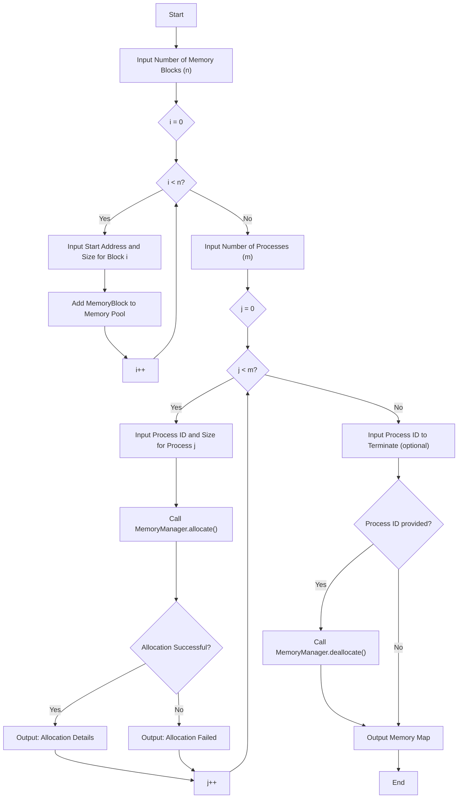
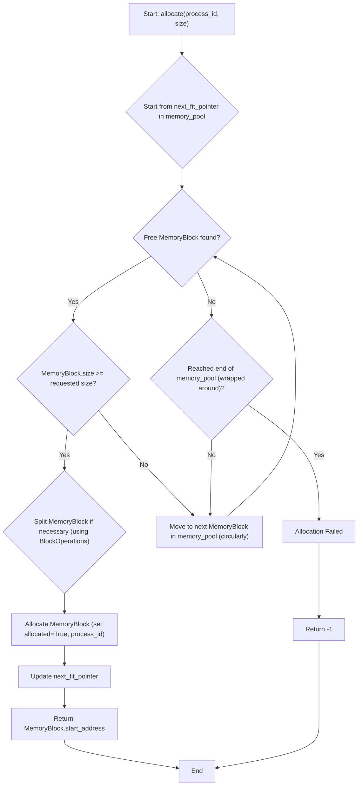
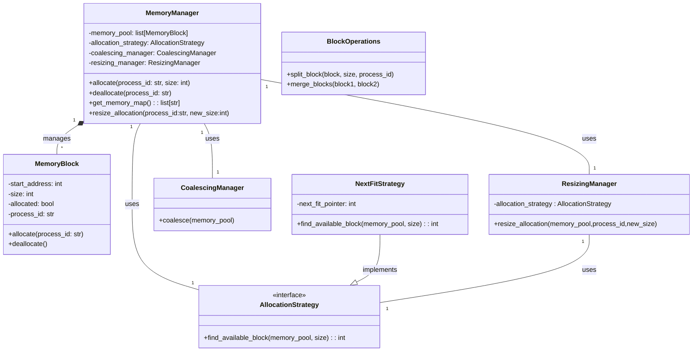

# Memory Simulation

This project simulates the Next Fit algorithm. The simulation is designed with a modular architecture for extension and maintainability.

## Features

This memory simulation offers a range of features designed for flexibility and extensibility. It implements the Next Fit allocation algorithm, managing memory blocks dynamically. The modular design, based on core components, allocation strategies, and utility modules, promotes code organization and makes it easier to integrate new functionalities. Key features include a `MemoryBlock` class for representing memory blocks, coalescing of free blocks to reduce fragmentation, and support for resizing allocated memory blocks (subject to available space). The extensible strategy pattern simplifies the addition of new allocation strategies, and a clear `MemoryManager` interface provides a straightforward way to interact with the simulation.

## Diagrams

### System Flow Diagram



### Next Fit Algorithm



### Class Diagram



## Project Structure

The project follows a well-organized structure to enhance code clarity and maintainability. The `memory_management` package contains sub-packages for core components (`memory_block.py`, `memory_manager.py`), allocation strategies (`next_fit.py`), and utility modules (`block_operations.py`, `coalescing_manager.py`). This modular structure separates concerns, making it easier to understand and modify individual parts of the system. 

```
.
├── LICENSE
├── main.py
├── README.md
└── src
    ├── core
    │   ├── __init__.py
    │   ├── memory_block.py
    │   ├── memory_manager.py
    ├── strategies
    │   ├── allocation_strategy.py
    │   ├── base_strategy.py
    │   ├── __init__.py
    └── utils
        ├── block_operations.py
        ├── coalescing_manager.py
        ├── __init__.py
        └── resizing_manager.py
```

## Getting Started

To get started with the simulation, clone the repository using `git clone <repository_url>`. Then, navigate to the project directory (`cd memory_simulation`) and run the simulation using `python main.py`. You can customize the simulation logic and parameters within the `main.py` file.

## Usage Example (in `main.py`)

The following example demonstrates how to use the `MemoryManager` and `NextFitStrategy` in your `main.py` file:

```python
from memory_management.core.memory_manager import MemoryManager
from memory_management.strategies.next_fit import NextFitStrategy

memory_manager = MemoryManager(total_size=100, allocation_strategy=NextFitStrategy())
print(memory_manager.get_memory_map())  # Print initial memory map

pid1 = memory_manager.allocate(1, 30)
# ... allocate, deallocate, resize as needed ...

print(memory_manager.get_memory_map()) # Print the final memory map
```